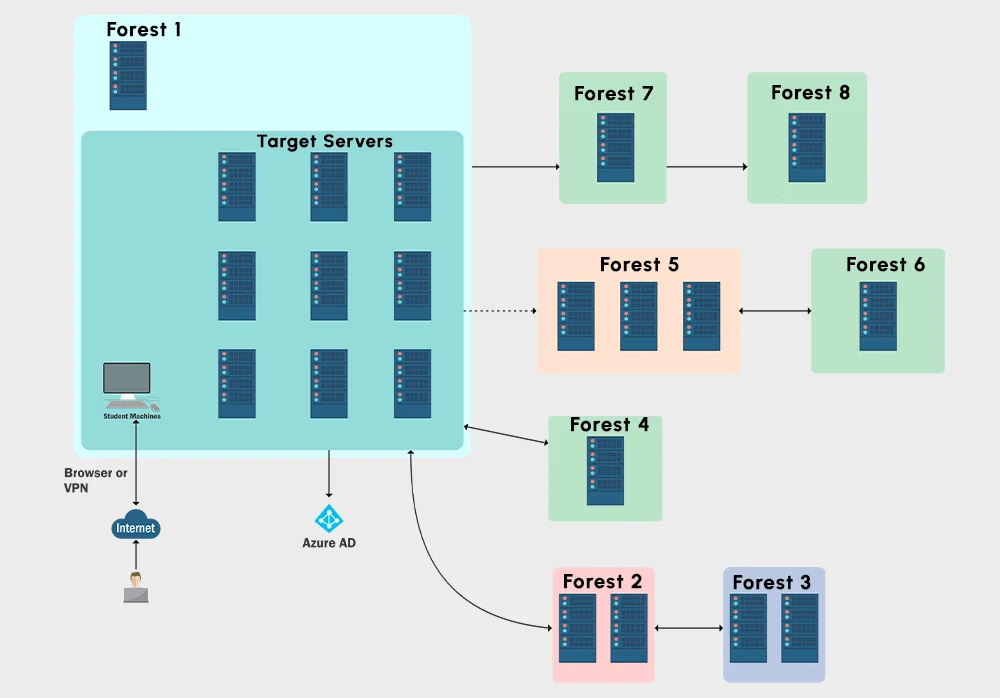

# Certified Red Team Expert (CRTE)

**28 Learning Objectives, 62 Tasks, >300 Hours of Torture**

<figure><figcaption>
Certified Red Team Expert LAB
</figcaption></figure>



### What will you Learn?

The Windows Red Team Lab enables you to:

* Practice various attacks in a fully patched real world Windows environment with Server 2019 and SQL Server 2017 machines.
* Abuse Active Directory and Windows features like LAPS, gMSA, AD CS and more
* Execute and visualize the attack path used by the modern adversaries.
* Attack Azure AD Integration (Hybrid Identity).
* Try new TTPs in a fully functional AD environment.
* Understand defenses and their bypasses for (JEA, PAW, LAPS, Selective Authentication, Deception, App Allowlisting, Microsoft Defender for Identity etc.)&#x20;

The following are the prerequisites for the lab:

* Basic understanding of red teaming/penetration testing or blue teaming/security administration of AD environment
* Ability to think like an adversary and inclination towards abusing features of AD rather than exploits.

### What's Included

* Access to a lab environment (One/Two/Three months) with updated Server 2019 machines. Lab can be accessed using a web browser or VPN.&#x20;
* 14+ hours of video course
* Course slides
* Two lab manuals. One for solving the lab using standalone tools. Second for solving the labs using C2.&#x20;
* Walk-through videos
* One Certification Exam attempt
